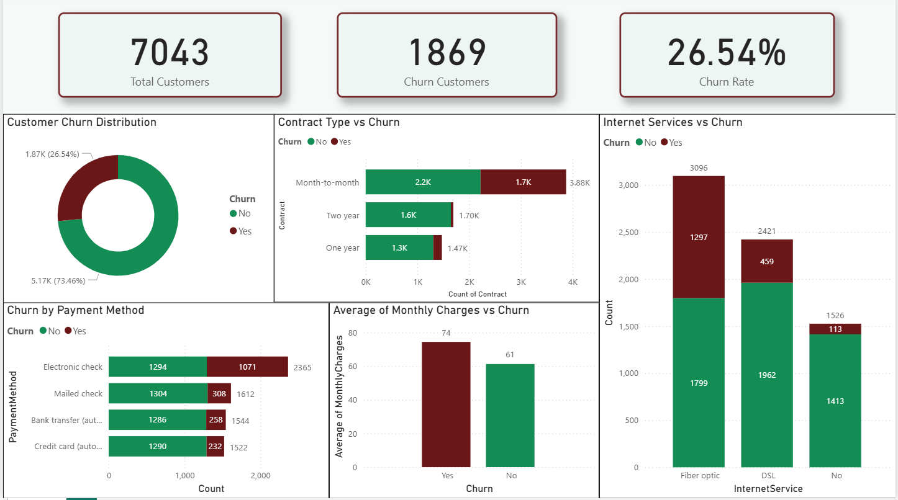

# 📊 Telco Customer Churn Analysis

An end-to-end data analysis and machine learning project to identify key drivers of customer churn and provide actionable business insights through visualization and predictive modeling.

---

## 📌 Problem Statement

Telecom companies face significant revenue loss due to customer churn. Identifying which customers are likely to leave and understanding the factors behind churn is crucial for improving retention strategies.

This project aims to analyze customer behavior, predict churn using machine learning, and visualize key insights through an interactive dashboard.

---

## 🎯 Project Objectives

- Analyze customer data to identify churn patterns  
- Build a machine learning model to predict churn  
- Identify key factors influencing customer attrition  
- Create a Power BI dashboard for business insights  

---

## 📁 Repository Structure
├── Customer Churn.csv
├── Telco_customer_churn.ipynb
├── cleaned_churn_viz.csv
├── Telco_Churn_Executive_Summary.docx
├── churn_dashboard.png
└── README.md

---

## 🛠️ Tools & Technologies Used

- Python (Pandas, NumPy, Matplotlib, Seaborn, Scikit-learn)  
- Power BI  

---

## 🧹 Data Preprocessing

- Handled missing values in `TotalCharges`  
- Converted data types (object → float)  
- Encoded categorical variables  
- Verified no duplicates  
- Final dataset contains **0 null values**  

---

## 🤖 Machine Learning Model

- Algorithm Used: Logistic Regression  
- Train-Test Split: 80/20  
- Accuracy Achieved: ~81%  

---

## 📊 Model Evaluation

- Used Accuracy Score  
- Used Confusion Matrix  

**Interpretation:**  
The model performs well in predicting customer churn, with a good balance between correctly identifying churned and retained customers.

---

## 📈 Dashboard Preview



---

## 📊 Key Insights from Dashboard

### 1. Churn Distribution
- Total Customers: 7,043  
- Churn Rate: 26.54%  

---

### 2. Contract Type (Strongest Factor)
- Month-to-month → Highest churn  
- Long-term contracts → Low churn  

---

### 3. Internet Service
- Fiber optic users → Highest churn  
- DSL users → Moderate  
- No internet → Lowest  

---

### 4. Payment Method
- Electronic check → Highest churn  
- Auto-pay methods → Lower churn  

---

### 5. Monthly Charges
- Customers with higher monthly charges churn more  
- Indicates price sensitivity  

---

## 💡 Business Recommendations

- Convert month-to-month users to long-term contracts  
- Provide incentives for auto-payment methods  
- Improve pricing/value for fiber optic users  
- Target high-paying customers with retention offers  

---

## 📋 Dataset Summary

- Records: 7,043 customers  
- Features: 21 columns  
- Churned: 1,869 customers  

---

## 🚀 How to Run

```bash
git clone https://github.com/your-username/telco-churn-analysis.git
cd telco-churn-analysis
pip install pandas numpy matplotlib seaborn scikit-learn jupyter
jupyter notebook Telco_customer_churn.ipynb


Author
P.Priti Subudhi |M.com Graduate| Aspiring Data Analyst|
